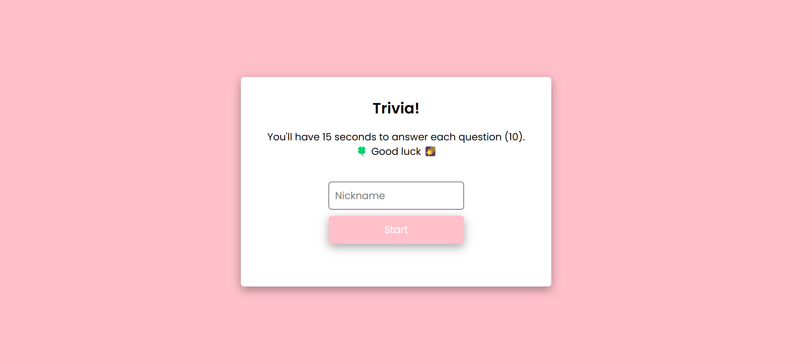
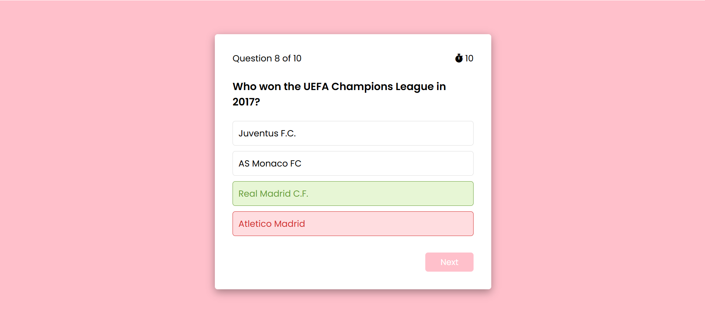
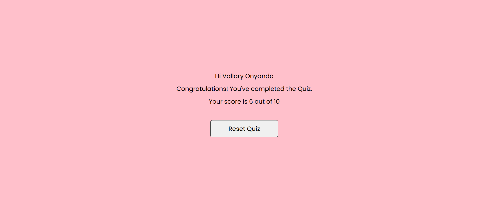

# Phase 1 Project - 🧠 Trivia! 🤯
Welcome to my Project Submission!

## Description
For the final phase-1 project submission at Moringa School, I chose to build a simple trivia webpage application using ***HTML***, ***CSS*** and ***JavaScript***.  Simply open the GitHub pages link - https://moringa-sdf-pt10.github.io/Vallary-Onyando-trivia-project/ on any browser and the trivia questions will be fetched from the public API - https://opentdb.com/api_config.php. 

## Execution
The screenshot below represents the display screen when you open the link. You will be prompted for a Nickname so we know who's playing, then you can click on Start!



PLAY🦦▶️

The next tile contains the question to answer, you'll have 15 seconds to do so before losing the right to. Green means correct while red implies you're wrong.



Lastly, after submitting, you're score will be detailed as shown on the last snapshot with the option to reset and try again with a new set of questions. 



## Contribution
Your contributions are most welcome!✍️(◔◡◔)

Follow the steps listed below to do so;
1. Fork the project.
2. Clone and open the forked project on your editor, like VS Code. From your terminal undertake the following: 

To clone;

```
git clone (copied SSH Key link)
```
To open on the editor;

```
code (folder name)
```

3. You can now make changes/contributions from VS Code by first creating your feature branch. 

```
git checkout -b (branch name)
```

4. Add and commit your changes. 

To add all the changes

```
git add .
```

To commit and log a message

```
git commit -m "commit message"
```

5. Push to the branch. 

```
git push -u (remote name, branch name)
```

6. Make a pull request. 

## Contact
Vallary Awuor Onyando - [LinkedIn](https://www.linkedin.com/in/val-onyando)
